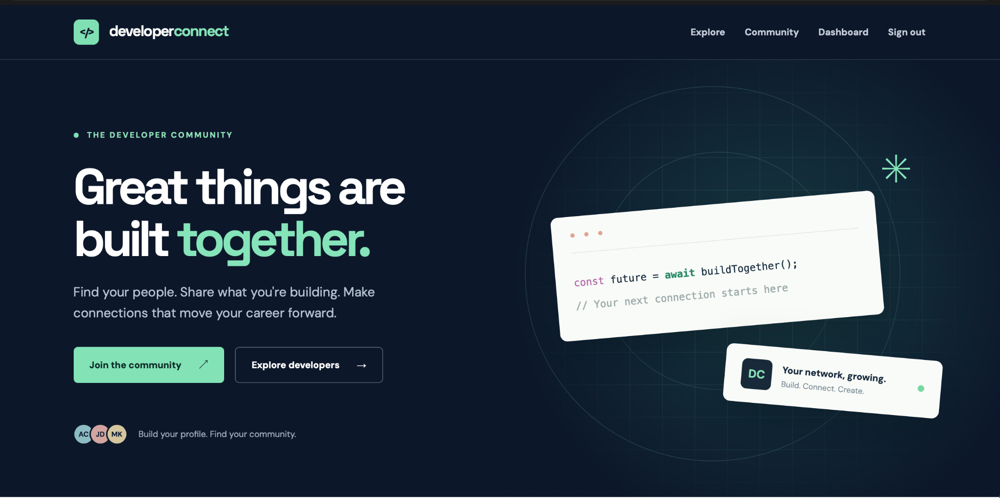
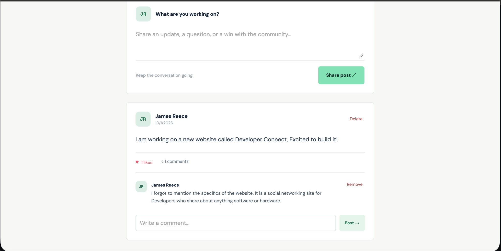
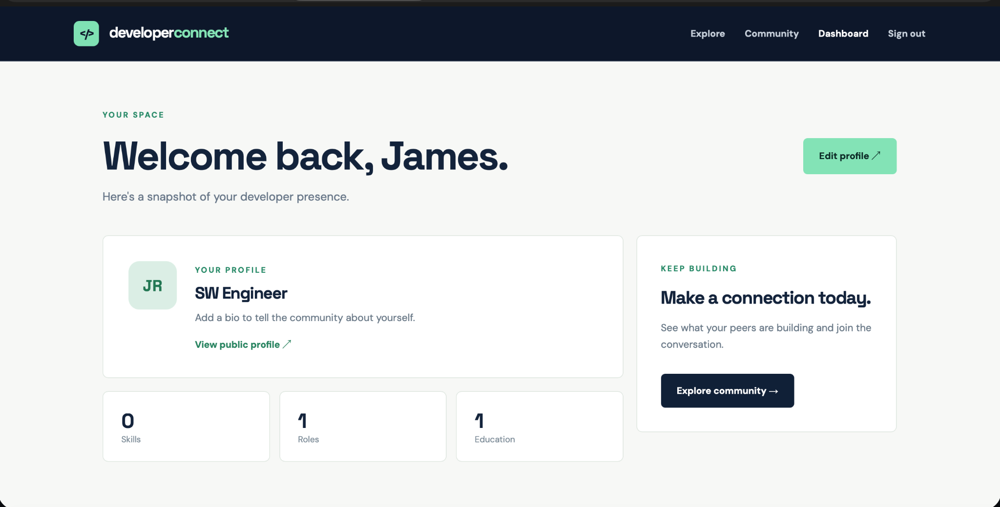

# Developer Connect

A full-stack community app where developers can create profiles, share their experience, and connect through posts, likes, and comments.

**[View live demo](https://radiant-ocean-47493-710490e192da.herokuapp.com/)** · [Source code](https://github.com/vanshvkoul1014/Developer-Connect)

Built with **React, Redux Toolkit, Node.js, Express, and MongoDB**. Deployed on **Heroku**, with the database hosted on **MongoDB Atlas**.



## Features

- **Authentication:** Register and sign in using hashed passwords and JSON Web Tokens.
- **Developer profiles:** Add a bio, skills, social links, work experience, and education.
- **Developer directory:** Browse and search public profiles.
- **Community feed:** Publish posts, toggle likes, and join discussions through comments.
- **Access controls:** Protected routes and ownership checks for deleting content.
- **Responsive interface:** Layouts that adapt to desktop and mobile screens.
- **API safeguards:** Server-side input validation and authentication rate limiting.

## Screenshots

### Community feed

Share updates and interact with other developers through likes and comments.



### Dashboard

Manage profile information, experience, and education from one place.



## Tech stack

| Area | Technologies |
| --- | --- |
| Frontend | React, React Router, Redux Toolkit, Vite, CSS |
| Backend | Node.js, Express |
| Database | MongoDB, Mongoose |
| Authentication | JSON Web Tokens, bcryptjs |
| Validation and middleware | Zod, Helmet, CORS, express-rate-limit |
| Hosting | Heroku, MongoDB Atlas |

The React frontend communicates with the Express REST API. Mongoose handles database access, and MongoDB stores users, profiles, and posts. In production, Express also serves the built frontend.

## Run locally

### Prerequisites

- Node.js **24.x** and npm
- A local MongoDB instance or a MongoDB Atlas connection string

### 1. Clone and install

```bash
git clone https://github.com/vanshvkoul1014/Developer-Connect.git
cd Developer-Connect
npm ci
```

### 2. Configure environment variables

Copy the example configuration into a `.env` file in the project root:

```bash
cp .env.example .env
```

Update the following values:

| Variable | Purpose |
| --- | --- |
| `MONGODB_URI` | Connection string for your MongoDB database |
| `JWT_SECRET` | A unique, random secret of at least 32 characters |
| `PORT` | API port; defaults to `5000` |
| `CLIENT_ORIGIN` | Frontend origin; use `http://localhost:5173` for local development |

You can generate a JWT secret with:

```bash
openssl rand -hex 32
```

Keep `.env` private. The repository includes `.env.example` for configuration guidance.

### 3. Start the app

If using local MongoDB, start it first. Then run:

```bash
npm run dev
```

Open **http://localhost:5173**. The frontend development server forwards `/api` requests to Express on port `5000`.

## Scripts

Run these commands from the project root:

| Command | Purpose |
| --- | --- |
| `npm run dev` | Start the frontend and backend in development mode |
| `npm run build` | Build the frontend into `client/dist` |
| `npm start` | Start the Express server |
| `npm test` | Run the server tests |

To serve the production build locally on macOS or Linux:

```bash
npm run build
NODE_ENV=production npm start
```

Open **http://localhost:5000**, or the port specified in your `.env` file.

Tests cover input validation and production hosting behavior, including frontend routes, unknown API routes, and authentication requirements. They are not a full end-to-end test suite.

## API overview

| Resource | Endpoints |
| --- | --- |
| Authentication | `POST /api/auth/register`, `POST /api/auth/login`, `GET /api/auth/me` |
| Public profiles | `GET /api/profiles`, `GET /api/profiles/:handle` |
| Own profile | `GET /api/profiles/me`, `PUT /api/profiles/me` |
| Experience | `POST /api/profiles/me/experience`, `DELETE /api/profiles/me/experience/:id` |
| Education | `POST /api/profiles/me/education`, `DELETE /api/profiles/me/education/:id` |
| Posts | `GET /api/posts`, `POST /api/posts`, `DELETE /api/posts/:id` |
| Likes | `PUT /api/posts/:id/like` |
| Comments | `POST /api/posts/:id/comments`, `DELETE /api/posts/:id/comments/:commentId` |

Protected endpoints require an `Authorization: Bearer <token>` header.

## Project structure

```text
client/
  src/                 React interface, state, and styles
  vite.config.js       Frontend build and development proxy
server/
  src/                 Express app, models, and validation
  test/                Validation and hosting tests
screenshots/           Images used in this README
.env.example           Example environment configuration
HEROKU.md              Heroku deployment instructions
Procfile               Heroku web process
package.json           Workspace scripts and Node.js version
```

## Deployment

The live app runs on Heroku with MongoDB Atlas. Heroku runs `heroku-postbuild` to build the frontend, then starts the web process defined in `Procfile`. With `NODE_ENV=production`, Express serves both the API and the frontend.

Set `MONGODB_URI` and `JWT_SECRET` in Heroku Config Vars, and set `CLIENT_ORIGIN` to your deployed frontend origin. Heroku supplies the runtime `PORT`.

See [HEROKU.md](HEROKU.md) for deployment instructions.

## Future improvements

- Email verification and password recovery
- Server-side developer search and directory pagination
- Broader integration and end-to-end test coverage

## Acknowledgments

The project concept was inspired by Brad Traversy's [MERN Stack Front To Back course](https://www.udemy.com/course/mern-stack-front-to-back/).
